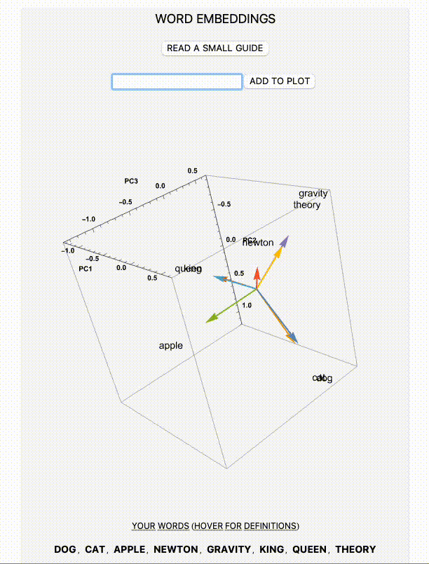

# Discover Word Embeddings using Mathematica

This is a mathematica package written in Wolfram Language. It aims to explain what word embeddings using a 3D plot and a little game.

It comes with a Tutorial.nb to discover more about word embeddings and with a little guide to use the interface with ease.

The project has been developed for [Computational Math](https://www.unibo.it/it/studiare/dottorati-master-specializzazioni-e-altra-formazione/insegnamenti/insegnamento/2023/479026)  university course [@unibo](https://www.unibo.it/it).

